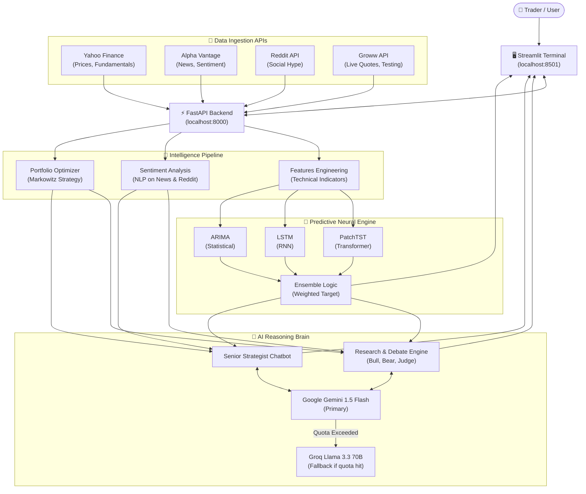

<div align="center">

# 📈 StockVision AI

### The Definitive Intelligence-First Trading Terminal & Predictive Ecosystem

[](https://python.org)
[](https://fastapi.tiangolo.com)
[](https://streamlit.io)
[](https://ai.google.dev)
[](https://groq.com)

**StockVision AI is not just a dashboard—it is a complete All-In-One Financial Intelligence Platform. It integrates institutional-grade predictive modeling, social sentiment harvesting, and Large Language Model (LLM) reasoning to provide a 360-degree view of the global financial markets.**

[](https://youtu.be/xH7hLXebkPg)

</div>

---

## ✨ Features

### 1. The Dual-Core AI Brain (High Availability)
*   **Primary Brain**: **Google Gemini 1.5 Flash**. Used for deep reasoning, mathematical step-by-step financial calculations, and executive communications analysis.
*   **Fail-Safe Engine**: **Groq (Llama 3.3 70B)**. An ultra-fast inference engine that takes over automatically if Gemini hits quota limits, ensuring your terminal never goes dark.

### 2. AI Research & Debate Engine
Simulates an elite investment committee for every ticker:
*   **The Bull Agent**: Synthesizes growth catalysts, competitive advantages, and technical breakouts.
*   **The Bear Agent**: Deep-dives into debt levels, overvaluation, regulatory risks, and macro headwinds.
*   **The Judge**: Reviews the debate, provides a neutral synthesis, and assigns a **Conviction Score (1-10)**.

### 3. Predictive Neural Engine (FastAPI Backend)
Every prediction request triggers a multi-model training and ensemble pipeline:
*   **PatchTST (Transformer)**: Modern transformer architecture for capturing complex, long-term dependencies in price data.
*   **LSTM (Long Short-Term Memory)**: A recurrent neural network optimized for market momentum and volatility patterns.
*   **ARIMA**: Statistical baseline modeling to ensure forecasts are grounded in historical trends.
*   **Ensemble Logic**: Weighted fusion of all three models for a finalized "Intelligence Price Target".

### 4. The Senior AI Strategist Chatbot
An integrated, context-aware conversationalist:
*   **Step-by-Step Math**: Ask "If I invest ₹10k today, what is my projected return?" and it will perform the calculations using live prices and the neural engine's forecast.
*   **Contextual Awareness**: The bot knows which ticker you are looking at and has access to its fundamentals, news sentiment, and current AI signal.
*   **Structured Advice**: Provides clear Rationale, Ticker Symbols, and Target Allocation percentages.

### 5. Market Context & Social Pulse
*   **Reddit Hype Score**: Scans **r/wallstreetbets**, **r/stocks**, **r/IndianStreetBets**, and more to calculate retail crowd momentum.
*   **Executive Tone Decoding**: NLP-driven analysis of management communications to detect "Confidence," "Defensiveness," or "Uncertainty."
*   **Global Sentiment**: Fuses Alpha Vantage and Yahoo Finance news streams into a single sentiment score.

---

## 🤔 The "All-In-One" Value Proposition

Most trading platforms provide data; StockVision AI provides **understanding**. It handles the entire pipeline of modern trading:
1.  **Ingestion**: Scrapes global news, Reddit trends, and institutional filings.
2.  **Forecasting**: Trains neural networks on-the-fly to predict price action.
3.  **Reasoning**: Uses AI to debate investment cases and decode management "tone".
4.  **Interaction**: A context-aware chatbot that knows your portfolio and the stocks you search.

By bridging the gap between raw data and actionable intelligence, StockVision AI empowers traders with the same technology used by quantitative hedge funds.

---

## 🏗️ Project Architecture



### Business Health Architecture
The platform provides instant visibility into 12+ critical financial metrics for **2,000+ Assets** (NSE India, S&P 500, Global Indices, and Crypto):
*   **Valuation**: Forward P/E, Trailing P/E, Price-to-Book (P/B), Market Cap.
*   **Profitability**: Return on Equity (ROE), Return on Assets (ROA), Operating Margins, Profit Margins.
*   **Liquidity & Debt**: Quick Ratio, Current Ratio, Debt-to-Equity.
*   **Growth**: Revenue Growth, Dividend Yield, Free Cash Flow.

### Codebase Structure

```text
stockvision-ai/
├── app/
│   ├── agents/          # Brain: Gemini/Groq logic & prompt engineering
│   ├── api/             # Nerve Center: FastAPI server & Neural endpoints
│   ├── data/            # Pipelines: Reddit, Groww, AV, and Ticker DBs
│   ├── features/        # Math: Feature engineering & technical indicators (RSI, BB)
│   ├── models/          # ML: PatchTST, LSTM, ARIMA & Ensemble logic
│   ├── portfolio/       # Strategy: Markowitz-style portfolio optimization
│   ├── sentiment/       # NLP: Sentiment scoring & text analysis
│   ├── services/        # Logic: Intelligence synthesis & Alert systems
│   └── utils/           # Helpers: Currency mapping, formatters, evaluations
├── dashboard/
│   └── streamlit_app.py # UI: Premium Terminal using Streamlit 1.55 Fragments
├── main.py              # CLI Entry point for local model tests
└── requirements.txt     # Complete dependency manifest
```

---

## 🚀 Getting Started

### 1. Clone the repo
```bash
git clone https://github.com/AayushTripathi07/stockvision-ai.git
cd stockvision-ai
```

### 2. Install Dependencies
```bash
python -m venv .venv
source .venv/bin/activate
pip install -r requirements.txt
```

### 3. Configure API Keys (.env)
Create an `.env` file in the root directory (never commit this file):

```env
GEMINI_API_KEY=your_key_here
GROQ_API_KEY=your_key_here
ALPHA_VANTAGE_API_KEY=your_key_here
GROWW_API_KEY=your_key_here
```

### 4. Run Platform
*   **Backend**: 
    ```bash
    uvicorn app.api.server:app --port 8000
    ```
*   **Frontend**: 
    ```bash
    streamlit run dashboard/streamlit_app.py
    ```

---

## 📡 Data Ecosystem (API Sources)

| Source | Functionality |
|---|---|
| **Yahoo Finance API** | Historical price streams, institutional holder data, and financial statements. |
| **Alpha Vantage** | Specialized News Sentiment endpoints and Earnings Calendars. |
| **Reddit API** | Real-time social trend harvesting (r/wallstreetbets, etc.). |
| **Groww API** | Deep-integrated for zero-latency Indian market quotes and order execution simulation. |
| **Google Gemini API** | Advanced LLM reasoning and content generation. |
| **Groq API** | High-speed LPU inference for Llama models. |

---

## 📸 Demo

[](https://youtu.be/xH7hLXebkPg)

---

<div align="center">

**Author: Aayush Tripathi**

[GitHub](https://github.com/AayushTripathi07) • [LinkedIn](https://linkedin.com/in/aayushtripathi07)

</div>